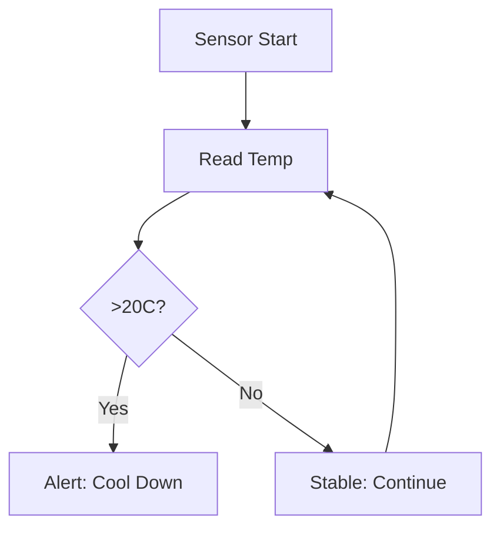

## Overview

The Brew Wizz app empowers you to master beverage creation with intuitive tools for brewing, carbonation, and monitoring. Access a vast recipe library, fine-tune fizz levels, track temperatures in real-time, and save custom profiles. These features streamline your workflow from novice to expert brewer.

<Callout kind="info">
  Connect your Brew Wizz device via Bluetooth before using these features. Ensure firmware is up to date for optimal performance.
</Callout>

## Key Features

Discover the core capabilities at a glance.

<Columns cols={2}>
  <Card title="Recipe Library" icon="book-open" href="#recipe-library">
    Browse and import thousands of community recipes tailored for fizzing success.
  </Card>
  <Card title="Carbonation Control" icon="zap" href="#carbonation-control">
    Precisely adjust CO2 levels with automated or manual modes.
  </Card>
  <Card title="Temperature Monitoring" icon="thermometer" href="#temperature-monitoring">
    Real-time charts and alerts keep your brew at perfect temps.
  </Card>
  <Card title="Custom Profiles" icon="settings" href="#custom-profiles">
    Build and share personalized brewing setups.
  </Card>
</Columns>

## Recipe Library Access

Unlock inspiration with the built-in library.

<Steps>
  <Step title="Connect Device" icon="bluetooth">
    Pair your Brew Wizz hardware in the app settings.
  </Step>
  <Step title="Browse Recipes" icon="search">
    Tap the library icon and filter by type (beer, soda, kombucha).
  </Step>
  <Step title="Import & Start" icon="play">
    Select a recipe and hit brew to load parameters automatically.
  </Step>
</Steps>

<Expandable title="Advanced Filters" default-open="false">
  Use tags like `{vegan}`, `{low-carb}` or search by ABV range for precise matches.
</Expandable>

## Carbonation Level Control

Achieve perfect fizz every time.

<Tabs>
  <Tab title="Manual Mode" icon="sliders">
    Adjust PSI manually:
    
````bash
Target: 2.5-3.2 PSI for sodas
Monitor: Shake test every 5 min
````
  </Tab>
  <Tab title="Auto Mode" icon="zap">
    Set target CO2 volume:
    
````javascript
{
  "targetCo2": "2.5",
  "duration": "24h",
  "temp": "4C"
}
````
  </Tab>
</Tabs>

## Temperature Monitoring

Keep conditions ideal with live data.



View historical charts and set alerts for deviations `{>20C}` or `{<2C}`.

<Callout kind="tip">
  Calibrate sensors weekly for accuracy within `±0.5C`.
</Callout>

## Custom Brew Profiles

Create profiles tailored to your needs.

<Steps>
  <Step title="New Profile" icon="plus">
    Go to Profiles > Add New.
  </Step>
  <Step title="Set Parameters" icon="sliders">
    Input temp curve, fizz target, and timers.
  </Step>
  <Step title="Save & Export" icon="download">
    Name it and share as JSON.
  </Step>
</Steps>

Here's a sample profile export:

<CodeGroup tabs="JSON,Share">
```json
{
  "name": "Citrus Fizz",
  "tempStart": 20,
  "tempEnd": 4,
  "co2": 2.8,
  "duration": "48h"
}
```

```bash
# Share via app
brew-wizz share profile.json
```
</CodeGroup>

## Best Practices

Combine features for pro results: Start with library recipes, tweak via custom profiles, monitor religiously. Experiment safely within device limits.

<Columns cols={2}>
  <Card title="Troubleshooting" icon="help-circle" href="/troubleshooting">
    Common fixes for fizz fails.
  </Card>
  <Card title="Advanced Guides" icon="book-open" href="/advanced">
    Multi-stage brews.
  </Card>
</Columns>